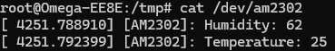

# AM2302 Linux driver
Driver written in C language in 2 options: 
* am2302_char_driver can work as a regular character driver without any compatibility checks.
* am2302_platform_char_driver works as a regular character driver but should be described in DTS. The DTS overlay is compiled during the build.

---
## How to compile
Require make, gcc and dtc. Define `CROSS_COMPILE` and `KDIR` variables for cross-compilation.
Type `make` to build kernel objects (*.ko).
Type `make clean` to clean the project.

*Note: you can disable DTS compilation if you don't need to build am2302_platform_char_driver object. Remove or comment out the appropriate line in Makefile.*

---
## How to use
Copy the DTS overlay (*.dtbo) to your device. Apply it:
`mkdir -p /sys/kernel/config/device-tree/overlays/am2302`
`cat <path-to-your-dtbo> > /sys/kernel/config/device-tree/overlays/am2302/dtbo`

Copy desired kernel object file (*.ko). Load the module:
`insmod <path-to-your-ko>`

Get the data about temperature and humidity:
`cat /dev/am2302`

Example output:

